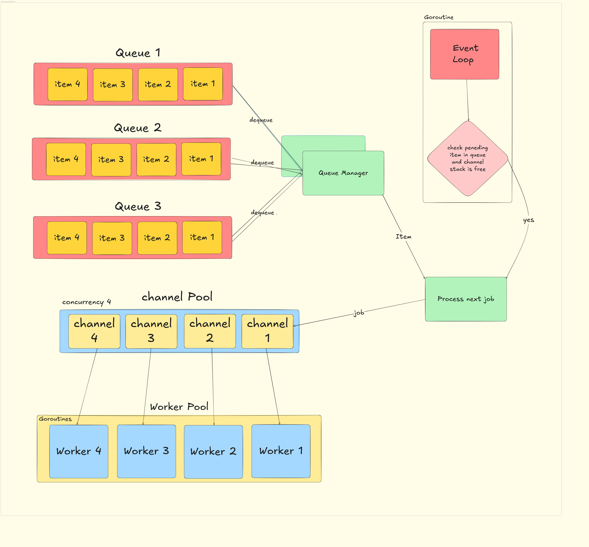

# VarMQ

[](https://pkg.go.dev/github.com/goptics/varmq)
[![DeepWiki](https://img.shields.io/badge/DeepWiki-goptics%2Fvarmq-blue.svg?logo=data:image/png;base64,iVBORw0KGgoAAAANSUhEUgAAACwAAAAyCAYAAAAnWDnqAAAAAXNSR0IArs4c6QAAA05JREFUaEPtmUtyEzEQhtWTQyQLHNak2AB7ZnyXZMEjXMGeK/AIi+QuHrMnbChYY7MIh8g01fJoopFb0uhhEqqcbWTp06/uv1saEDv4O3n3dV60RfP947Mm9/SQc0ICFQgzfc4CYZoTPAswgSJCCUJUnAAoRHOAUOcATwbmVLWdGoH//PB8mnKqScAhsD0kYP3j/Yt5LPQe2KvcXmGvRHcDnpxfL2zOYJ1mFwrryWTz0advv1Ut4CJgf5uhDuDj5eUcAUoahrdY/56ebRWeraTjMt/00Sh3UDtjgHtQNHwcRGOC98BJEAEymycmYcWwOprTgcB6VZ5JK5TAJ+fXGLBm3FDAmn6oPPjR4rKCAoJCal2eAiQp2x0vxTPB3ALO2CRkwmDy5WohzBDwSEFKRwPbknEggCPB/imwrycgxX2NzoMCHhPkDwqYMr9tRcP5qNrMZHkVnOjRMWwLCcr8ohBVb1OMjxLwGCvjTikrsBOiA6fNyCrm8V1rP93iVPpwaE+gO0SsWmPiXB+jikdf6SizrT5qKasx5j8ABbHpFTx+vFXp9EnYQmLx02h1QTTrl6eDqxLnGjporxl3NL3agEvXdT0WmEost648sQOYAeJS9Q7bfUVoMGnjo4AZdUMQku50McDcMWcBPvr0SzbTAFDfvJqwLzgxwATnCgnp4wDl6Aa+Ax283gghmj+vj7feE2KBBRMW3FzOpLOADl0Isb5587h/U4gGvkt5v60Z1VLG8BhYjbzRwyQZemwAd6cCR5/XFWLYZRIMpX39AR0tjaGGiGzLVyhse5C9RKC6ai42ppWPKiBagOvaYk8lO7DajerabOZP46Lby5wKjw1HCRx7p9sVMOWGzb/vA1hwiWc6jm3MvQDTogQkiqIhJV0nBQBTU+3okKCFDy9WwferkHjtxib7t3xIUQtHxnIwtx4mpg26/HfwVNVDb4oI9RHmx5WGelRVlrtiw43zboCLaxv46AZeB3IlTkwouebTr1y2NjSpHz68WNFjHvupy3q8TFn3Hos2IAk4Ju5dCo8B3wP7VPr/FGaKiG+T+v+TQqIrOqMTL1VdWV1DdmcbO8KXBz6esmYWYKPwDL5b5FA1a0hwapHiom0r/cKaoqr+27/XcrS5UwSMbQAAAABJRU5ErkJggg==)](https://deepwiki.com/goptics/varmq)
[](https://go.dev/play/p/gx-Q8Qf7BWd)
[](https://goreportcard.com/report/github.com/goptics/varmq)
[](https://golang.org/doc/devel/release.html)
[](https://github.com/goptics/varmq/actions/workflows/go.yml)

[](LICENSE)

<!-- global issue with [](https://codecov.io/gh/goptics/varmq) -->

**VarMQ** is a high-performance message queue for Go that simplifies concurrent task processing using [worker pool](#the-concurrency-architecture). Using Go generics, it provides type safety without sacrificing performance.

With VarMQ, you can process messages asynchronously, handle errors properly, store data persistently, and scale across systems when needed. All through a clean, intuitive API that feels natural to Go developers.

This isn't meant to replace RabbitMQ or Kafka - VarMQ serves a different purpose as a lightweight, in-process message queue with strong worker management. For persistence and distribution, it offers a flexible [adapter system](#built-in-adapters) that extends its capabilities beyond simple in-memory queues.

## ✨ Features

- **⚡ High performance**: Optimized for throughput control with minimal overhead
- **🛠️ Variants of queue types**:
  - Standard queues for in-memory processing
  - Priority queues for importance-based ordering
  - Persistent queues for durability across restarts
  - Distributed queues for processing across multiple systems
- **🧩 Worker abstractions**:
  - `NewWorker` - Fire-and-forget operations (most performant)
  - `NewErrWorker` - Returns only error (when result isn't needed)
  - `NewResultWorker` - Returns result and error
- **🚦 Concurrency control**: Fine-grained control over worker pool size, dynamic tuning and idle workers management
- **Multi Queue Binding**: Bind multiple queues to a single worker
- **💾 Persistence**: Support for durable storage through adapter interfaces
- **🌐 Distribution**: Scale processing across multiple instances via adapter interfaces
- **🧩 Extensible**: Build your own storage adapters by implementing simple interfaces

## Quick Start

### Installation

```bash
go get github.com/goptics/varmq
```

### Basic Usage

```go
package main

import (
    "fmt"
    "time"

    "github.com/goptics/varmq"
)

func main() {
  worker := varmq.NewWorker(func(j varmq.Job[int]) {
    fmt.Printf("Processing %d\n", j.Data())
    time.Sleep(500 * time.Millisecond)
  }, 10) // with concurrency 10
  defer worker.WaitUntilFinished()
  queue := worker.BindQueue()

  for i := range 100 {
    queue.Add(i)
  }
}
```

↗️ **[Run it on Playground](https://go.dev/play/p/XugpmYb9Dal)**

### Priority Queue

You can use priority queue to prioritize jobs based on their priority. Lower number = higher priority.

```go
// just bind priority queue
queue := worker.BindPriorityQueue()

// add jobs to priority queue
for i := range 10 {
    queue.Add(i, i%2) // prioritize even tasks
}
```

↗️ **[Run it on Playground](https://go.dev/play/p/w_RuYKv-VxB)**

## 💡 Highlighted Features

### Persistent and Distributed Queues

VarMQ supports both persistent and distributed queue processing through adapter interfaces:

- **Persistent Queues**: Store jobs durably so they survive program restarts
- **Distributed Queues**: Process jobs across multiple systems

Usage is simple:

```go
// For persistent queues (with any IPersistentQueue adapter)
queue := worker.WithPersistentQueue(persistentQueueAdapter)

// For distributed queues (with any IDistributedQueue adapter)
queue := worker.WithDistributedQueue(distributedQueueAdapter)
```

See complete working examples in the [examples directory](./examples):

- [Persistent Queue Example (SQLite)](./examples/sqlite-persistent)
- [Persistent Queue Example (Redis)](./examples/redis-persistent)
- [Distributed Queue Example (Redis)](./examples/redis-distributed)

Create your own adapters by implementing the `IPersistentQueue` or `IDistributedQueue` interfaces.

> Note: Before testing examples, make sure to start the Redis server using `docker compose up -d`.

### Multi Queue Binds

Bind multiple queues to a single worker, enabling efficient processing of jobs from different sources with configurable strategies. The worker supports three strategies:

1. **RoundRobin** (default - cycles through queues equally)
2. **MaxLen** (prioritizes queues with more jobs)
3. **MinLen** (prioritizes queues with fewer jobs)

```go
worker := varmq.NewWorker(func(j varmq.Job[string]) {
  fmt.Println("Processing:", j.Data())
  time.Sleep(500 * time.Millisecond) // Simulate work
}) // change strategy through using varmq.WithStrategy
defer worker.WaitUntilFinished()

// Bind to a standard queues
q1 := worker.BindQueue()
q2 := worker.BindQueue()
pq := worker.BindPriorityQueue()

for i := range 10 {
  q1.Add(fmt.Sprintf("Task queue 1 %d", i))
}

for i := range 15 {
  q2.Add(fmt.Sprintf("Task queue 2 %d", i))
}

for i := range 10 {
  pq.Add(fmt.Sprintf("Task priority queue %d", i), i%2) // prioritize even tasks
}
```

↗️ **[Run it on Playground](https://go.dev/play/p/_j_ZDLZqvtX)**

It will process jobs from all queues in a `round-robin` fashion.

### Result and Error Worker

VarMQ provides a `NewResultWorker` variant that returns both the result and error for each job processed. This is useful when you need to handle both success and failure cases.

```go
worker := varmq.NewResultWorker(func(j varmq.Job[string]) (int, error) {
 fmt.Println("Processing:", j.Data())
 time.Sleep(500 * time.Millisecond) // Simulate work
 data := j.Data()

 if data == "error" {
  return 0, errors.New("error occurred")
 }

 return len(data), nil
})
defer worker.WaitUntilFinished()
queue := worker.BindQueue()

// Add jobs to the queue (non-blocking)
if job, ok := queue.Add("The length of this string is 31"); ok {
 fmt.Println("Job 1 added to queue.")

 go func() {
  result, _ := job.Result()
  fmt.Println("Result:", result)
 }()
}

if job, ok := queue.Add("error"); ok {
 fmt.Println("Job 2 added to queue.")

 go func() {
  _, err := job.Result()
  fmt.Println("Result:", err)
 }()
}
```

↗️ **[Run it on Playground](https://go.dev/play/p/W8Pi_QrzTHe)**

`NewErrWorker` is similar to `NewResultWorker` but it only returns error.

### Function Helpers

VarMQ provides helper functions that enable direct function submission similar to the `Submit()` pattern in other pool packages like [Pond](https://github.com/alitto/pond) or [Ants](https://github.com/panjf2000/ants)

- **`Func()`**: For basic functions with no return values - use with `NewWorker`
- **`ErrFunc()`**: For functions that return errors - use with `NewErrWorker`
- **`ResultFunc[R]()`**: For functions that return a result and error - use with `NewResultWorker`

```go
// Example using Func() with standard worker
worker := varmq.NewWorker(varmq.Func(), 10)
defer worker.WaitUntilFinished()

queue := worker.BindQueue()

for i := range 100 {
    queue.Add(func() {
        time.Sleep(500 * time.Millisecond)
        fmt.Println("Processing", i)
    })
}
```

↗️ **[Run it on Playground](https://go.dev/play/p/YO4vOu3sg9f)**

> **Note:** Function helpers don't support persistence or distribution since functions cannot be serialized.

## Benchmarks

Command: `go test -bench=. -benchmem -cpu=1`

```text
goos: linux
goarch: amd64
pkg: github.com/goptics/varmq
cpu: 13th Gen Intel(R) Core(TM) i7-13700
```

| Benchmark Operation                         | Time (ns/op) | Memory (B/op) | Allocations (allocs/op) |
| ------------------------------------------- | ------------ | ------------- | ----------------------- |
| Queue Add                                   | 918          | 129           | 3                       |
| **Queue AddAll (1000 items)**               | 636077       | 146147        | 4002                    |
| PriorityQueue Add                           | 982          | 144           | 4                       |
| **PriorityQueue AddAll (1000 items)**       | 733161       | 162140        | 5002                    |
| ErrWorker Add                               | 1011         | 305           | 6                       |
| **ErrWorker AddAll (1000 items)**           | 660412       | 170952        | 4505                    |
| ErrPriorityQueue Add                        | 1026         | 320           | 7                       |
| **ErrPriorityQueue AddAll (1000 items)**    | 764678       | 186662        | 5505                    |
| ResultWorker Add                            | 1021         | 353           | 6                       |
| **ResultWorker AddAll (1000 items)**        | 657587       | 188079        | 4005                    |
| ResultPriorityQueue Add                     | 1034         | 368           | 7                       |
| **ResultPriorityQueue AddAll (1000 items)** | 746419       | 203263        | 5005                    |

**Note:** `AddAll` benchmarks were performed by adding 1000 items in a single call. The reported `ns/op`, `B/op`, and `allocs/op` for `AddAll` are for the entire batch operation. To estimate per-item metrics for an `AddAll` operation, divide the table values by 1000 (e.g., for Queue AddAll, the average time per item is approximately 636 ns).

## Why VarMQ?

- **Simple API**: Clean, intuitive interface that doesn't get in your way
- **High Performance**: Optimized for throughput control with minimal overhead
- **Minimal Dependencies**: Core library has no external dependencies
- **Production Ready**: Built for real-world scenarios and high-load applications
- **Highly Extensible**: Create your own storage adapters by implementing VarMQ's [internal queue interfaces](./diagrams/interface.drawio.png)

### Built-in adapters

- ⚡ Redis: [redisq](https://github.com/goptics/redisq)
- 🗃️ SQLite: [sqliteq](https://github.com/goptics/sqliteq)
- 🦆 DuckDB: [duckq](https://github.com/goptics/duckq)
- 🐘 PostgreSQL: 🔄 Upcoming

## API Reference

For detailed API documentation, see the **[API Reference](./docs/API_REFERENCE.md)**.

## The Concurrency Architecture

VarMQ's concurrency model is built around a smart event loop that keeps everything running smoothly.

The event loop continuously monitors for pending jobs in queues and available workers in the pool. When both conditions are met, jobs get distributed to workers instantly. When there's no work to distribute, the system enters a low-power wait state.

Workers operate independently - they process jobs and immediately signal back when they're ready for more work. This triggers the event loop to check for new jobs and distribute them right away.

The system handles worker lifecycle automatically. Idle workers either stay in the pool or get cleaned up based on your configuration, so you never waste resources or run short on capacity.



## Contributing

Contributions are welcome! Please feel free to submit a Pull Request.

## 👤 Author

- GitHub: [@fahimfaisaal](https://github.com/fahimfaisaal)
- LinkedIn: [in/fahimfaisaal](https://www.linkedin.com/in/fahimfaisaal/)
- Twitter: [@FahimFaisaal](https://twitter.com/FahimFaisaal)
