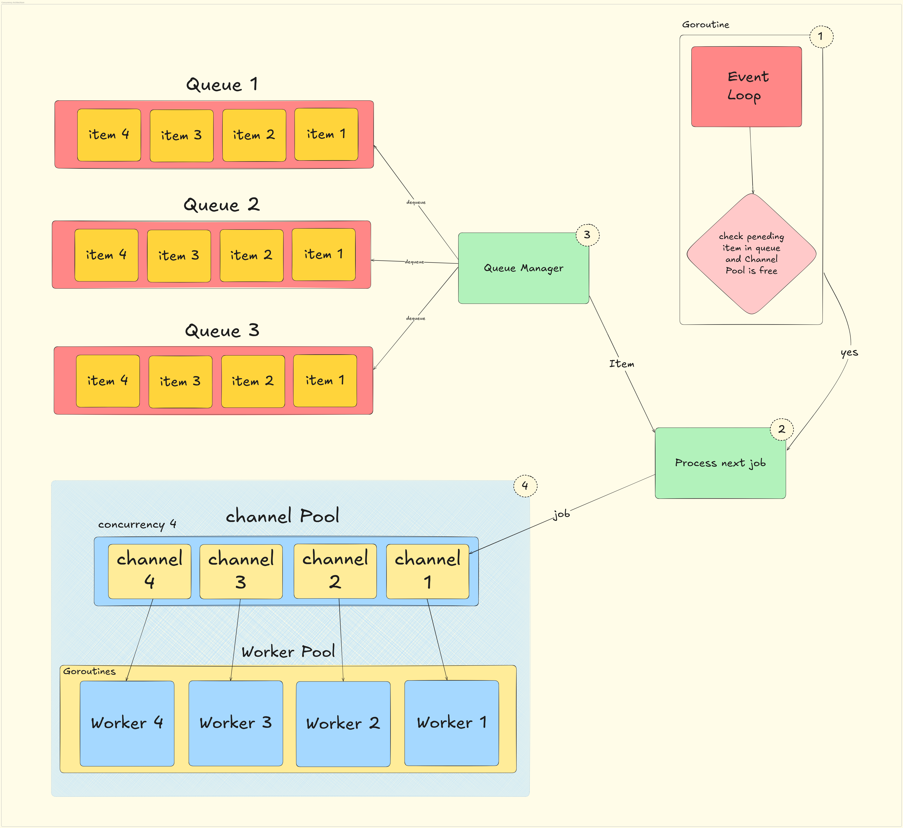

# VarMQ

[](https://github.com/avelino/awesome-go?tab=readme-ov-file#messaging)
[](https://pkg.go.dev/github.com/goptics/varmq)
[](https://goreportcard.com/report/github.com/goptics/varmq)
[](https://github.com/goptics/varmq/actions/workflows/ci.yml)
[](https://codecov.io/gh/goptics/varmq)
[](https://golang.org/doc/devel/release.html)
[](LICENSE)

A high-performance message queue and pool system for Go that simplifies concurrent task processing using [worker pool](#the-concurrency-architecture). Through Go generics, it provides type safety without sacrificing performance.

With `VarMQ`, you can process messages asynchronously, handle errors properly, store data persistently, and scale across systems using [adapters](#built-in-adapters). All through a clean, intuitive API that feels natural to Go developers.

## ✨ Features

- **⚡ High performance**: Optimized for high throughput with minimal overhead, even under heavy load. [see benchmarks](#benchmarks)
- **🛠️ Variants of queue types**:
  - Standard queues for in-memory processing
  - Priority queues for importance-based ordering
  - Persistent queues for durability across restarts
  - Distributed queues for processing across multiple systems
- **🧩 Worker abstractions**:
  - `NewWorker` - Fire-and-forget operations (most performant)
  - `NewErrWorker` - Returns only error (when result isn't needed)
  - `NewResultWorker` - Returns result and error
- **🚦 Concurrency control**: Fine-grained control over worker pool size, dynamic tuning and idle workers management
- **🧬 Multi Queue Binding**: Bind multiple queues to a single worker
- **💾 Persistence**: Support for durable storage through adapter interfaces
- **🌐 Distribution**: Scale processing across multiple instances via adapter interfaces
- **📡 REST API**: Built-in HTTP endpoints to inspect worker status and manage state (pause, resume, stop, restart)
- **🧩 Extensible**: Build your own storage adapters by implementing VarMQ's [internal queue interfaces](./assets/diagrams/interface.drawio.png)

## Quick Start

### Installation

```bash
go get github.com/goptics/varmq
```

### Basic Usage

```go
package main

import (
    "fmt"
    "time"

    "github.com/goptics/varmq"
)

func main() {
  worker := varmq.NewWorker(func(j varmq.Job[int]) {
    fmt.Printf("Processing %d\n", j.Data())
    time.Sleep(500 * time.Millisecond)
  }, 10) // with concurrency 10 or set 0 for parallelism
  defer worker.WaitUntilIdle()
  queue := worker.BindQueue()

  for i := range 100 {
    queue.Add(i)
  }
}
```

↗️ **[Run it on Playground](https://go.dev/play/p/uP0rA-NrzZB)**

### Priority Queue

You can use priority queue to prioritize jobs based on their priority. `Lower number = higher priority`

```go
// just bind priority queue
queue := worker.BindPriorityQueue()

// add jobs to priority queue
for i := range 10 {
    queue.Add(i, i%2) // prioritize even tasks
}
```

↗️ **[Run it on Playground](https://go.dev/play/p/CHF8PVyrBI0)**

## 💡 Highlighted Features

### Persistent and Distributed Queues

VarMQ supports both persistent and distributed queue processing through adapter interfaces:

- **Persistent Queues**: Store jobs durably so they survive program restarts
- **Distributed Queues**: Process jobs across multiple systems

Usage is simple:

```go
// For persistent queues (with any IPersistentQueue adapter)
queue := worker.WithPersistentQueue(persistentQueueAdapter)

// For distributed queues (with any IDistributedQueue adapter)
queue := worker.WithDistributedQueue(distributedQueueAdapter)
```

See complete working examples in the [examples directory](./examples):

- [Persistent Queue Example (SQLite)](./examples/sqlite-persistent)
- [Persistent Queue Example (Redis)](./examples/redis-persistent)
- [Distributed Queue Example (Redis)](./examples/redis-distributed)

Create your own adapters by implementing the `IPersistentQueue` or `IDistributedQueue` interfaces.

> [!Note]
> Before testing examples, make sure to start the Redis server using `docker compose up -d`.

#### Built-in adapters

- ⚡ Redis: [redisq](https://github.com/goptics/redisq)
- 🗃️ SQLite: [sqliteq](https://github.com/goptics/sqliteq)
- 🦆 DuckDB: [duckq](https://github.com/goptics/duckq)
- 🐘 PostgreSQL: 🔄 Upcoming

### Multi Queue Binds

Bind multiple queues to a single worker, enabling efficient processing of jobs from different sources with configurable strategies. The worker supports four strategies:

1. **Priority** (default - prioritizes higher priority queues that have pending jobs)
2. **RoundRobin** (cycles through queues equally)
3. **MaxLen** (prioritizes queues with more jobs)
4. **MinLen** (prioritizes queues with fewer jobs)

```go
worker := varmq.NewWorker(func(j varmq.Job[string]) {
	fmt.Println("Processing:", j.Data())
	time.Sleep(500 * time.Millisecond) // Simulate work
}) // change strategy through using varmq.WithStrategy default is varmq.Priority
defer worker.WaitUntilIdle()

// Bind to a standard queues with coronological priorities
// You can change queue priority using varmq.WithQueuePriority function
q1 := worker.BindQueue()         // highest
q2 := worker.BindQueue()         // medium
pq := worker.BindPriorityQueue() // lowest

for i := range 15 {
	q2.Add(fmt.Sprintf("Task queue-2 %d", i))
}

for i := range 10 {
	pq.Add(fmt.Sprintf("Task priority-queue %d", i), i%2) // prioritize even tasks
}

for i := range 10 {
	q1.Add(fmt.Sprintf("Task queue-1 %d", i))
}
```

↗️ **[Run it on Playground](https://go.dev/play/p/0eL_0WNRVIh)**

### Result and Error Worker

VarMQ provides a `NewResultWorker` that returns both the result and error for each job processed. This is useful when you need to handle both success and failure cases.

```go
worker := varmq.NewResultWorker(func(j varmq.Job[string]) (int, error) {
 fmt.Println("Processing:", j.Data())
 time.Sleep(500 * time.Millisecond) // Simulate work
 data := j.Data()

 if data == "error" {
  return 0, errors.New("error occurred")
 }

 return len(data), nil
})
defer worker.WaitUntilIdle()
queue := worker.BindQueue()

// Add jobs to the queue (non-blocking)
if job, ok := queue.Add("The length of this string is 31"); ok {
 fmt.Println("Job 1 added to queue.")

 go func() {
  result, _ := job.Result()
  fmt.Println("Result:", result)
 }()
}

if job, ok := queue.Add("error"); ok {
 fmt.Println("Job 2 added to queue.")

 go func() {
  _, err := job.Result()
  fmt.Println("Result:", err)
 }()
}
```

↗️ **[Run it on Playground](https://go.dev/play/p/4jkGb9SAIrp)**

`NewErrWorker` is similar to `NewResultWorker` but it returns only error.

### Function Helpers

VarMQ provides helper functions that enable direct function submission similar to the `Submit()` pattern in other pool packages like [Pond](https://github.com/alitto/pond) or [Ants](https://github.com/panjf2000/ants)

- **`Func()`**: For basic functions with no return values - use with `NewWorker`
- **`ErrFunc()`**: For functions that return errors - use with `NewErrWorker`
- **`ResultFunc[R]()`**: For functions that return a result and error - use with `NewResultWorker`

```go
worker := varmq.NewWorker(varmq.Func(), 10)
defer worker.WaitUntilIdle()

queue := worker.BindQueue()

for i := range 100 {
    queue.Add(func() {
        time.Sleep(500 * time.Millisecond)
        fmt.Println("Processing", i)
    })
}
```

↗️ **[Run it on Playground](https://go.dev/play/p/J2xXmVlGYyW)**

> [!Important]
> Function helpers don't support persistence or distribution since functions cannot be serialized.

### REST API

VarMQ provides a built-in HTTP REST API for inspecting worker status and managing worker state remotely. Register the handler on any `http.Server` to expose endpoints:

```go
mux := http.NewServeMux()
mux.Handle("/varmq/", varmq.Handler("/varmq"))
http.ListenAndServe(":8080", mux)
```

Available endpoints:

| Method   | Path                                      | Description                  |
|----------|-------------------------------------------|------------------------------|
| `GET`    | `/health`                                 | Health check                 |
| `GET`    | `/workers`                                | List all workers (summary)   |
| `GET`    | `/workers/{name}`                         | Get worker details + metrics |
| `PATCH`  | `/workers/{name}/actions/{action}`        | Pause, resume, stop, restart |
| `PATCH`  | `/workers/{name}/config/concurrency/{n}`  | Adjust concurrency           |

> [!Warning]
> The REST API is unauthenticated by design. Protect it with middleware, network isolation, or a reverse proxy before exposing to untrusted networks.

## Benchmarks

```text
goos: linux
goarch: amd64
pkg: github.com/goptics/varmq
cpu: 13th Gen Intel(R) Core(TM) i7-13700
```

### `Add` Operation

Command: `go test -run=^$ -benchmem -bench '^(BenchmarkAdd)$' -cpu=1`

> Why use `-cpu=1`? Since the benchmark doesn’t test with more than 1 concurrent worker, a single CPU is ideal to accurately measure performance.

| Worker Type      | Queue Type     | Time (ns/op) | Memory (B/op) | Allocations (allocs/op) |
| ---------------- | -------------- | ------------ | ------------- | ----------------------- |
| **Worker**       | Queue          | 1,045        | 113           | 2                       |
|                  | Priority       | 1,072        | 128           | 3                       |
| **ErrWorker**    | ErrQueue       | 1,153        | 289           | 5                       |
|                  | ErrPriority    | 1,145        | 304           | 6                       |
| **ResultWorker** | ResultQueue    | 1,167        | 337           | 5                       |
|                  | ResultPriority | 1,155        | 352           | 6                       |

### `AddAll` Operation

Command: `go test -run=^$ -benchmem -bench '^(BenchmarkAddAll)$' -cpu=1`

| Worker Type      | Queue Type     | Time (ns/op) | Memory (B/op) | Allocations (allocs/op) |
| ---------------- | -------------- | ------------ | ------------- | ----------------------- |
| **Worker**       | Queue          | 649,822      | 130,601       | 3,002                   |
|                  | Priority       | 776,409      | 146,139       | 4,002                   |
| **ErrWorker**    | ErrQueue       | 684,882      | 154,895       | 3,505                   |
|                  | ErrPriority    | 808,360      | 170,661       | 4,505                   |
| **ResultWorker** | ResultQueue    | 690,249      | 171,540       | 3,005                   |
|                  | ResultPriority | 803,115      | 187,262       | 4,005                   |

> [!Note]
>
> `AddAll` benchmarks use a batch of **1000 items** per call. The reported numbers (`ns/op`, `B/op`, `allocs/op`) are totals for the whole batch. For per-item values, divide each by 1000.  
> e.g. for default `Queue`, the average time per item is approximately **580ns**.

Why is `AddAll` faster than individual `Add` calls? Here's what makes the difference:

1. **Batch Processing**: Uses a single group job to process multiple items, reducing per-item overhead
2. **Shared Resources**: Utilizes a single result channel for all items in the batch

### Comparison with Other Packages

We conducted comprehensive benchmarking between `VarMQ` and [Pond v2](https://github.com/alitto/pond), as both packages provide similar worker pool functionalities. While `VarMQ` draws inspiration from some of Pond's design patterns, `VarMQ` offers unique advantages in queue management and persistence capabilities.

**Key Differences:**

- **Queue Types**: `VarMQ` provides multiple queue variants (standard, priority, persistent, distributed) vs Pond's single pool type
- **Multi-Queue Management**: `VarMQ` supports binding multiple queues to a single worker with configurable strategies (Priority, RoundRobin, MaxLen, MinLen)

For detailed performance comparisons and benchmarking results, visit:

- 📊 **[Benchmark Repository](https://github.com/goptics/varmq-benchmarks)** - Complete benchmark suite
- 📈 **[Interactive Charts](https://varmq-benchmarks.netlify.app/)** - Visual performance comparisons

## API Reference

For the complete package documentation, types, and method signatures, browse the **[GoDoc](https://pkg.go.dev/github.com/goptics/varmq)**.

## The Concurrency Architecture

VarMQ's concurrency model is built around a smart event loop that keeps everything running smoothly.

The event loop continuously monitors for pending jobs in queues and available workers in the pool. When both conditions are met, jobs get distributed to workers instantly. When there's no work to distribute, the system enters a low-power wait state.

Workers operate independently - they process jobs and immediately signal back when they're ready for more work. This triggers the event loop to check for new jobs and distribute them right away.

The system handles worker lifecycle automatically. Idle workers either stay in the pool or get cleaned up based on your configuration, so you never waste resources or run short on capacity.



## Star History

[](https://www.star-history.com/#goptics/varmq&Date)

## Contributing

Contributions are welcome! Please feel free to submit a Pull Request or open an issue.

Please note that this project has a [Code of Conduct](CODE_OF_CONDUCT.md). By participating in this project, you agree to abide by its terms.
